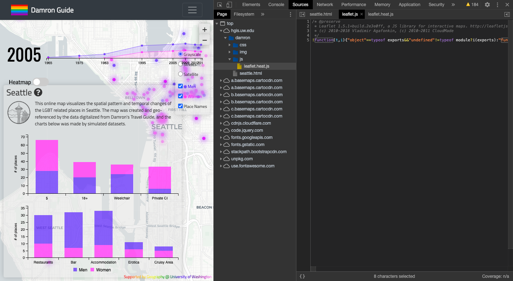

### Cedrik Pearson
### Bo Zhao
### Advanced Digital Geographies
### 5 May 2020

**Analyzing the Damron Guide: Seattle Web Map**
Web mapping has come a long way in recent years with packages like leaflet.js making it extremely easy for anyone with a little bit of web design experience to make a quick and powerful interactive map accessible from anywhere with an internet connection. One benefit of using these open-source libraries lies in their ability to convey information quickly and freely, something traditionally underrepresented groups can use to share their message, as well as stay safe. A good example of this technology at work is the ‘Damron Guide: Seattle’ web map hosted by the University of Washington Humanistic GIS Laboratory. The Damron Guide allowed gay readers the opportunity to find places of refuge where they could be with people like themselves, where they could feel comfortable. The web map version of the Damron Guide: Seattle, creates an interactive space for not only those in the LGBTQ community, but researchers with a vested interest in the spatio-temporal aspects of the Seattle’s gay establishments. The map displays locations historically associated with gay men as purple points, and places for women are displayed as pink. Users can interact with the map by using a slider that changes the year of interest at irregular intervals from 1965 to 2014, changing the number of locations as time moves on. Bar charts associated with the relevant statistics of the locations for each year are displayed when the slider is moved to a specific year of interest. In order to do this the map utilizes various javascript libraries including leaflet and leaflet.heat to make the map function. Basemaps are handled by Carto, and the combination of these separate technologies allow for the map to employ principles of cartography including color, shape, and typography to tell a very effective story.

The Damron Guide is one of the first travel guides for gay and lesbian members of society, and has been producing the guide since 1964. This has been hugely instrumental in helping LGBTQ travelers find places where they can be themselves without fear of harassment. Even today members of this community are not always given the same rights and respect reserved to their straight counterparts, so the fact this guide has existed since ‘64 speaks to its importance amongst the LGBTQ community. The Humanistic GIS Laboratory at the University of Washington partially exists to “geo-narrate to geo-narrate a variety of geographic phenomena, especially those related to vulnerable populations” (UW HGIS Lab). The choice to create the Damron Guide: Seattle web map, was to shed light on the spatio-temporal changes in Seattle’s LGBTQ establishments through the use of “innovative geospatial technologies ”. The audience is specifically targeted to be those in the LGBTQ community, as well as anyone interested in how LGBTQ places have changed throughout time in the Seattle area. This project goes beyond a simple informative map, thanks to the inclusion of the slider. The slider allows users to see how these places have changed with time, providing summary statistics for each year’s establishments. The number of establishments are displayed by category as separate histograms: number of erotica stores, number of bars, etc. all split by sex. This allows researchers to gain a better understanding of these places. The Damron Guide: Seattle interactive web map is built on an entirely web-based architecture. The client allowing the map to be accessed and interacted with is the web browser of the user’s choice. From this client, the user can move around the map, zoom in and out, and choose different eras to change the map’s visualization. As these actions take place data is sent back and forth between the client and the server fairly quickly, starting with the html css and js pages. After these corresponding files are loaded, the main data being sent around is the tile images as the user scrolls around the map. Zooming in and out and also panning causes map tile images to be loaded as they are required for every different view.
There are two major libraries that are the backbone for this webmap, namely leaflet.js and leaflet.heat.js. Leaflet.js is the javascript library that enables the map to be displayed along with its interactivity. The leaflet.js file is formatted strangely in this particular instance, as for some reason the code is all displayed as one really long line containing all the important functions allowing for the different operations on the map. These operations consist of panning the map, zooming, the point features and the click enabled pop-ups for each point.

Leaflet.heat.js is the second major library. The script containing this library is called leaflet.heat.js and consists of three very long lines of code that allow for the heat map to be displayed on the main page. On the web map there is a toggle button that when switched to the on position eliminates the point features and creates a heat map showing more color in areas of higher concentrations of LGBTQ establishments.

The underlying styles of the map are attributed to the Bootstrap framework. Bootstrap makes styling the web map with CSS much easier and creates the different buttons and their individual styles. When using the Google Developer Tools, it is clear that responsive design was not of the utmost importance to the developers. As the size of the screen is changed to different shapes and sizes, the content of the map becomes unreadable. The text displayed on the
left side of the page above the histograms does not shrink down as the page gets skinnier, it moves off the edge of the page.
The data sources for this web map can be identified when using the Chrome Developer Tools Network Analysis tools. There are two types of data present in this web map, raster data and vector data. The points that represent the LGBTQ establishments are stored as geoJSON files, one file per gender and year. Each point has attributes for the year, where each location is, the type of location it is, etc. The basemap is represented through a series of mapping tiles saved as picture files (.png) These picture files allow the basemap to be drawn at different zoom levels and pan around.

These two data sources make the web map function from a visual standpoint, and the other javascript libraries allow for the interactive functions. The above technologies create a nice looking web map that tells a convincing story about the LGBTQ community in Seattle, and the map applies many important principles of cartography to do so. The basemap is informative, showing the streets and place names of Seattle proper, in a light grayscale theme. The basemap is easy to read and allows for easy differentiation between it and the thematic layer. The LTBTQ establishment points are symbolized as pink for female locations and purple for male locations, which are very noticeable against the light grey. Despite the nice look of the grey, the user also has the option to change to a street basemap or a satellite imagery layer.
Many of the basics of a map can be found in this example:
* The title bar along the top displays the name, and when dropped down gives a detailed description of the map.
* The legend is interactive, allowing the user to turn off the male or female layer by checking or unchecking them in the legend.
* There is no scale bar or north arrow to be seen.

The Damron Guide: Seattle tells a powerful story of how far the LGBTQ community has come in the city of Seattle. A group traditionally suppressed by mainstream culture and often facing violent persecution, having a place to safely exist with other members of their community can be extremely meaningful to individual members. The Damron Guide: Seattle web map is a very innovative way for members of the community to not only study this vulnerable population and their geographies, but a convenient tool that members can use to lift themselves up and find places of refuge in a quick, beautiful manner.
